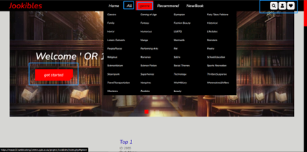

# Jookibles

Entity Relationship diagram of your MySQL table(s)

List of functions:

1. Login (member and administrator)
2. Return different hint for user (member and
   administrator)
3. Register (member)
4. Add book (administrator)
5. Add genre (administrator)
6. Edit book (administrator)
7. Edit genre (administrator)
8. Delete book (administrator)
9. Confirm delete book
10. Manage account (administrator)
11. Block account (administrator)
12. Manage review (administrator)
13. Search book by keyword or id to edit
    (administrator)
14. Search book by keyword or id to delete
    (administrator)
15. Search user by keyword or id to edit
    (administrator)
16. Sign out (member and administrator)
17. Back function back to last page (administrator)
18. List all book (Member
    and anonymous)
19. List book by genre (Member
    and anonymous)
20. List book by search (Member
    and anonymous)
21. List new book (Member
    and anonymous)
22. Back and refresh page (Member
    and anonymous)
23. Favourite book from book list (Member)
24. Favourite book in book page (Member)
25. Show Recommend book (Member)
26. Write review (Member)
27. Look review (Member
    and anonymous)
28. Rate book (Member)
29. Look rate of book (Member
    and anonymous)
30. Change password (Member)
31. Delete review in comment list (Member)
32. Unfavourite in wish list (Member)

API:

Book API and review API is public resource.

User API is private resource just for group, company ….

Reference:

Index page css and js learn some part from this but code and fixed by
myself [https://www.youtube.com/c/MrWebDesignerAnas](https://www.youtube.com/c/MrWebDesignerAnas)

5 stars css learn from [https://www.youtube.com/watch?v=Ep78KjstQuw](https://www.youtube.com/watch?v=Ep78KjstQuw)

Login page css and js learn from: [https://www.youtube.com/watch?v=lIi9rqW-yJY&t=308s](https://www.youtube.com/watch?v=lIi9rqW-yJY&t=308s)

